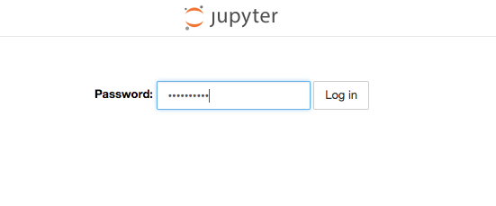

# 如何部署notebook

### 前提
请按照 [配置本地环境](../setup/SETUP_LOCAL.md) 这章配置本地环境。
请按照 [安装机器学习基础架构Arena](../setup/INSTALL_ARENA.md) 这章安装基础架构Arena。


#### 部署Notebook
安装Notebook时支持配置Ingress， 支持TLS为您的访问提供安全防护。
1. 准备您的服务证书。如果您没有证书，可以通过以下命令配置
```
# foo.bar.com 可以替换为您自己的域名
# domain="foo.bar.com"
# openssl req -x509 -nodes -days 365 -newkey rsa:2048 -keyout tls.key -out tls.crt -subj "/CN=$domain/O=$domain"
```

上述步骤中的命令会生成一个证书文件 tls.crt、一个私钥文件tls.key。

2. 用该证书和私钥创建一个名为 notebook-secret 的 Kubernetes Secret。
```
# kubectl create secret tls notebook-secret --key tls.key --cert tls.crt
```

3. 部署Notebook
```
# foo.bar.com 可以替换为您自己的域名
# curl -s https://raw.githubusercontent.com/AliyunContainerService/ai-starter/master/scripts/install_notebook.sh | \
bash -s -- \
--ingress --ingress-domain foo.bar.com --ingress-secret notebook-secret \
--password <your password>
```

上述安装执行中，可以通过以下参数定制部署的依赖组件：

```
--namespace         指定部署的Notebook所在Namespace
--password          指定部署的Notebook密码，如果不声明我们会自动创建密码
--ingress           指定是否为Notebook配置Ingress
--ingress-domain    指定为Notebook配置的Ingress域名，仅在指定--ingress时生效
--ingress-secret    指定为Notebook配置的Ingress，HTTPS使用的证书Secret，仅在指定--ingress时生效
--pvc-name          指定Notebook用于挂载的存储声明，默认会将Notebook的/root目录挂载至这个存储声明，默认为training-data
--notebook-image    指定Notebook的使用镜像，默认是registry.cn-beijing.aliyuncs.com/acs/arena-notebook:cpu
--clean             如果指定了--clean参数，会清理之前通过脚本部署的Notebook应用
```

4. 安装完成后，检查安装结果：

```
# 查看arena 依赖
# kubectl -n arena-system get po
NAME                                      READY   STATUS    RESTARTS   AGE
mpi-operator-5f89ddc9bf-5mw4c             1/1     Running   0          4d
tf-job-dashboard-7dc786b7fb-t57wx         1/1     Running   0          4d
tf-job-operator-v1alpha2-98bfbfc4-9d66t   1/1     Running   0          4d

# 查看notebook安装结果
# kubectl get po
NAME                              READY   STATUS      RESTARTS   AGE
arena-notebook-5bd4d8c5f7-jc7vf   1/1     Running     0          4d
```

### 访问Notebook
#### 通过Ingress访问Notebook
打印Notebook的IP地址和Ingress域名地址：

```
# curl -s https://raw.githubusercontent.com/AliyunContainerService/ai-starter/master/scripts/print_notebook.sh | bash -s --
Notebook pod ip is 172.16.1.103
Notebook service ip is 172.19.12.5
Ingress of notebook ip is 39.104.xx.xx
Ingress of notebook domain is foo.bar.com
```

如果您有自己的DNS解析，可以将ingress的域名解析到对应的Ingress IP。 您也可以通过修改本地host文件的方式，将Ingress的域名解析Ingress的IP。通过Ingress域名访问Notebook。

输入密码，即可访问notebook <br />
<br />


您可以开始机器学习之旅了！